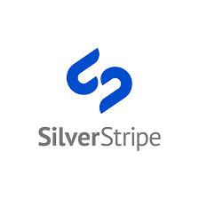

<html>

<head></head>

<body>
   

              <ul>
                  <h2 class="mb-3"><b>¿Qué es SilverStripe?</b></h2>
                
Es de código abierto, respaldado por documentación pública, de código libre y una gran comunidad de desarrolladores.  
                    Se basa en estándares abiertos y es compatible con múltiples plataformastecnológicas. SilverStripe CMS está construido y apoyado comercialmente 
                    por SilverStripeLtd., una compañía de software responsable de garantizar la innovación, el enfoque y la calidad en el software.

             
                    <h2 class="mb-3"><b>Ventajas de SilverStripe</b></h2>
                  <ul>
                      <li type="disc">Editar el contenido con facilidad.</li>
                      <li type="disc">Libertad de diseño.</li>
                      <li type="disc">Simple, intuitivo.</li>
                      <li type="disc">Framework de código flexible (utiliza el patrón MVC).</li>
                      <li type="disc">Estructuración modular, lo que facilita la ampliación..</li>
                      <li type="disc">Es opensource.</li>
                      <li type="disc">Multiplataforma.</li>
                  </ul>
              </ul>
    

</body>
</html>